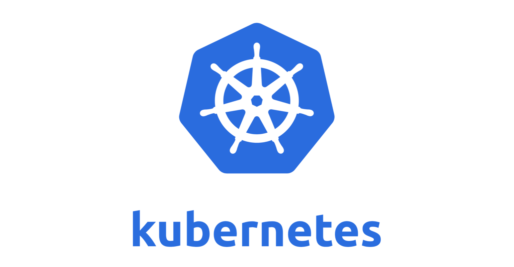

# Kubernete



## Introduction

Operating a [Redis Cluster](https://redis.io/topics/cluster-tutorial) on [Kubernete](https://kubernetes.io/) (or anywhere) is not trivial, and it took a lot of trial and errors to end up with a good setup. Thanksfully the internet was full of guides which helped a lot.

The important bit is that we use a StatefulSet to manage pods, which helps with keeping references to our persistence state stable. StatefulSet would be the recommended object to manage a database, and redis is just a special in memory database (with disk persistence unlike [Memcached](https://www.memcached.org/)).

### Scaling

Scaling up the cluster horizontally, by adding new notes can be done by changing the replicas count of the StatefulSet. Here we have it set at 14 nodes total, in our case we have a quorum of one and as many master nodes as replica nodes.

```
serviceName: redis-cluster
replicas: 14
```

Scaling the cluster vertically can also be done. You can set how many cpus and how much memory your instances can use, through the *resources* field. Note that this will affect how much disk space you need, refer to the persistence section for more details.

```
resources:
  limits:
    cpu: "1"
    memory: 1Gi
  requests:
    cpu: "1"
    memory: 1Gi
```

### Upgrading redis

Upgrading the version of redis can be done by just changing the docker image. The latest version at this point is 6.0.8. Downgrading redis is done the same way.

```
containers:
- name: redis
  image: redis:6.0.8-alpine
```

### Persistence

Redis will save its state to disk in a volume claim. Your namespace might have a restriction on how many volumes can be mounted, for us a limit of 5 had to be lifted to 6 (the minimal amount of nodes in a redis cluster) for staging environment, and much more for our production one.

```
  volumeClaimTemplates:
  - metadata:
      name: data
    spec:
      accessModes: [ "ReadWriteOnce" ]
      resources:
        requests:
          storage: 1Gi
```

### Accessing redis using the cluster-ip

The ip that your application should use to reach redis is the one provided in the redis service k8s object, through the cluster-ip. In the example below it is 172.16.8.213.

```
$ kubectl get svc redis-cluster
NAME            TYPE        CLUSTER-IP     EXTERNAL-IP   PORT(S)              AGE
redis-cluster   ClusterIP   172.16.8.213   <none>        6379/TCP,16379/TCP   47d
```

There are many more endpoints internally, for each redis nodes, gossip and normal port.

```
$ kubectl get endpoints redis-cluster
NAME            ENDPOINTS                                                              AGE
redis-cluster   172.24.142.24:6379,172.24.56.2:6379,172.26.145.236:6379 + 25 more...   47d
```

You could use one of those endpoints, and we actually did that for a while. However the CLUSTER-IP port will load balance to all the redis instances and is actually the best one to use. If you were to pick the first endpoint ip, say 172.24.142.24:6379 and hard-code it in your application, if kubernete restart one of the redis node and give it a new ip, you are now out of luck.

Another bit to make sure that a redis instance can be reached outside of its host is to set the protected-mode setting to no, or else only connections coming from the localhost will be accepted.

```
protected-mode no
```

### Handling restarts

In cluster mode, redis writes on disk a file containing the ip and node ids of all the redis instances making the cluster. Those ips can get out of date and a restart could make redis unable to be reachable by other peer nodes. To fix that, we use a config map containing a special shell script that is starting redis, which helps keeping the redis nodes accurate on startup.

```
  update-node.sh: |
    #!/bin/sh
    REDIS_NODES="/data/nodes.conf"
    sed -i -e "/myself/ s/[0-9]\{1,3\}\.[0-9]\{1,3\}\.[0-9]\{1,3\}\.[0-9]\{1,3\}/${POD_IP}/" ${REDIS_NODES}
    exec "$@"
```

### Limitation

The cluster is not reachable outside of the current namespace, so services talking to this redis instance need to run in the same namespace.

### Config files.

Copy the blobs below into 2 files.

```
$ cat redis-sts.yaml
---
apiVersion: v1
kind: ConfigMap
metadata:
  name: redis-cluster
data:
  update-node.sh: |
    #!/bin/sh
    REDIS_NODES="/data/nodes.conf"
    sed -i -e "/myself/ s/[0-9]\{1,3\}\.[0-9]\{1,3\}\.[0-9]\{1,3\}\.[0-9]\{1,3\}/${POD_IP}/" ${REDIS_NODES}
    exec "$@"
  redis.conf: |+
    cluster-enabled yes
    cluster-require-full-coverage no
    cluster-node-timeout 15000
    cluster-config-file /data/nodes.conf
    cluster-migration-barrier 1
    appendonly yes
    protected-mode no
---
apiVersion: apps/v1
kind: StatefulSet
metadata:
  name: redis-cluster
spec:
  serviceName: redis-cluster
  replicas: 14
  selector:
    matchLabels:
      app: redis-cluster
  template:
    metadata:
      labels:
        app: redis-cluster
    spec:
      containers:
      - name: redis
        image: redis:6.0.6-alpine
        ports:
        - containerPort: 6379
          name: client
        - containerPort: 16379
          name: gossip
        resources:
          limits:
            cpu: "1"
            memory: 1Gi
          requests:
            cpu: "1"
            memory: 1Gi
        command: ["/conf/update-node.sh", "redis-server", "/conf/redis.conf"]
        env:
        - name: POD_IP
          valueFrom:
            fieldRef:
              fieldPath: status.podIP
        volumeMounts:
        - name: conf
          mountPath: /conf
          readOnly: false
        - name: data
          mountPath: /data
          readOnly: false
      volumes:
      - name: conf
        configMap:
          name: redis-cluster
          defaultMode: 0755
  volumeClaimTemplates:
  - metadata:
      name: data
    spec:
      accessModes: [ "ReadWriteOnce" ]
      resources:
        requests:
          storage: 1Gi
```

```
$ cat redis-svc.yaml
---
apiVersion: v1
kind: Service
metadata:
  name: redis-cluster
spec:
  type: ClusterIP
  ports:
  - port: 6379
    targetPort: 6379
    name: client
  - port: 16379
    targetPort: 16379
    name: gossip
  selector:
    app: redis-cluster
```

1. `kubectl create -f redis-sts.yaml`
2. `kubectl create -f redis-svc.yaml`

Wait a bit and your cluster instances will be up and running. However you still need to initialize it.

```
$ kubectl get pods
NAME              READY     STATUS    RESTARTS   AGE
cobra-210-9nnbt   1/1       Running   0          4h
rcc               1/1       Running   0          1h
redis-cluster-0   1/1       Running   0          1d
redis-cluster-1   1/1       Running   0          1d
redis-cluster-2   1/1       Running   0          1d
redis-cluster-3   1/1       Running   0          1d
redis-cluster-4   1/1       Running   0          1d
redis-cluster-5   1/1       Running   0          1d
```

You will need the ip address of all the instances, as the input for the redis-cli. This can be obtained with a fancy jsonpath operation, and thanks to a selector for app=redis-cluster.

```
$ kubectl get pods -l app=redis-cluster -o jsonpath='{range.items[*]}{.status.podIP}:6379 '
172.31.4.97:6379 172.29.113.210:6379 172.29.137.154:6379 172.29.188.130:6379 172.25.145.152:6379 172.31.253.250:6379
```

We will execute the create redis-cli command on the first machine in our redis cluster, redis-cluster-0.

```
kubectl exec -it redis-cluster-0 -- redis-cli --cluster create --cluster-yes 172.31.4.97:6379 172.29.113.210:6379 172.29.137.154:6379 172.29.188.130:6379 172.25.145.152:6379 172.31.253.250:6379 --cluster-replicas 1
```

The --cluster-yes option will skip confirmation prompts. That option broke in redis 5 but was [fixed](https://github.com/redis/redis/commit/29f25e411124af036450289bc9869bf2d9a709ac) in redis-6. One last tip is that to use the redis-cli in cluster mode, you should pass the additional -c option.
